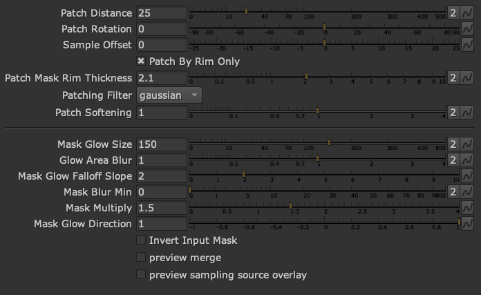

# jm_cleanPatchGen

A tool for cleaning, repairing, and patching plates. Generates a gradient patch based on the source in the masked area. Works well on source with grain and high frequency detail extracted.

A gizmo for generating clean patches to cover stuff that needs to be removed in plates. The output is meant as a quick start in a comp, not a final result, and there will probably need to be added fine details like grain etc.

It is work in progress, and it is possible to mess the result, but if used responsibly it will produce usable results ;)