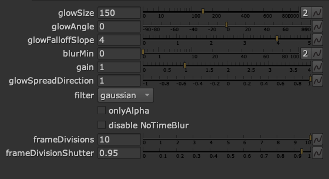

# jm_glow

A log-ish glow with controls for in/out direction, falloff shape and angle.

Preferes a masked input.

Besides regular glowing objects and background to forground glow, it is also good for glowing and expanding/shrinking masks.