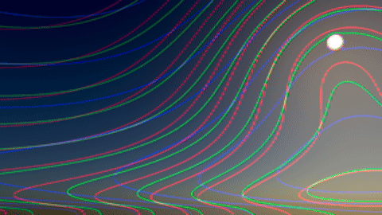

# jm_gradientAnalyzer

Generates lines perpendicular to gradients, useful for analyzing and visualizing flow, direction and smoothness in large soft gradients.

Good for spotting bumps and errors from cleanup, cloning and patching in soft gradients.

Adjusting the Pre CC sliders rolls the lines so all parts of the image can be evaluated.

Tested back to Nuke 12 on windows, but should work with other versions as well.

