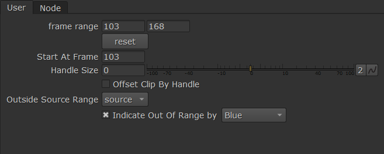

# jm_improvedFrameRange

A tool for plucking shots out of conformed sources, and for handling handles.

It's a frameRate node, but with extra controls for adding/removing handles, start frame, and what to use outside the range (source/hold/black/loop/bounce).

Good for plucking shots out of a conformed sequence like a reference video, and also good for adjusting handles on source shots.

Updated with the option to add visual indication on the image when the current time is outside the selected range. 