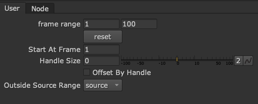

# jm_improvedFrameRange

A tool good for plucking shots out of conformed sources, and for handling handles.

Like a frameRate node, but with extra controls for adding/removing handles, start frame, and what to use outside the range (source/hold/black/loop/bounce).

Good for plucking shots out of a conformed sequence like a reference video, and also good for adjusting handles on source shots.