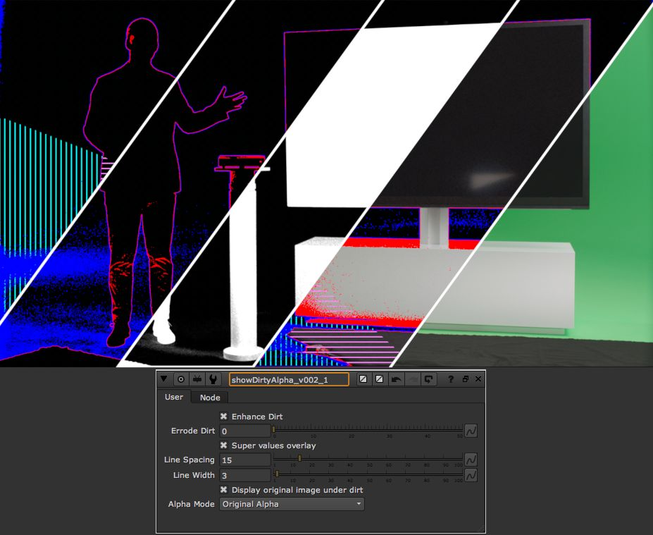

# jm_showDirtyAlpha2

A tool for checking keyed plates and assisting the keying process by finding and displaying areas of the alpha channel that is not completely clean white or black. Also displays alpha values below 0 and over 1.

ShowDirtyAlpha

A tool for displaying areas of the alpha channel that is not completely white or black.

Updated with more display options: Better and adjustable super black and super white overlay, an option to errode the dirt overlay so small details can be spottes easily, overlay the dirt ontop of the plate directly in the gizmo, and diferent alpha output modes.

Red is close to white (holes in the opaque parts of the alpha)

Blue is close to black (dirt in the transparent areas)

Cyan vertical stripes is alpha > 1

Purple horisontal stripes is alpha < 0

Black is nice and clean :)